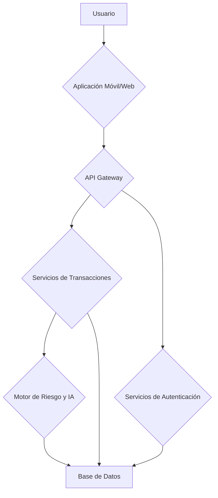
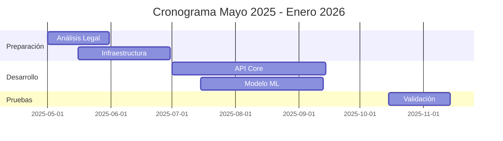

# Security 

Create a more secure security system than the current ones, to prevent theft, scams or any crime that may occur on the web.


## 📋 Tabla de Contenidos
1. [Descripción del Proyecto](#-descripción-del-proyecto)
2. [Tecnologías Utilizadas](#-Tecnologías-Utilizadas)
3. [Diagrama Tecnico](#technical-flowchart)
4. [Cronograma de Implementación](#-cronograma-de-implementación)
5. [Estructura del Proyecto](#-Folder-structures)
6. [Instalación y Configuración](#en-proceso)
7. [Documentación API](#en-proceso)


## 🚀 Descripción del Proyecto
Sistema inteligente para detección de transacciones fraudulentas en tiempo real mediante:
- API REST con FastAPI
- Modelos de Machine Learning (LightGBM)
- Autenticación MFA
- Encriptación AES-256

**Objetivo Principal:**  
Reducir en un 40% los casos de fraude en el primer año de implementación.


## 💻 Tecnologías Utilizadas
| Categoría       | Tecnologías                                                                 |
|-----------------|----------------------------------------------------------------------------|
| Backend         | FastAPI, Python 3.10, Uvicorn                                              |
| Machine Learning| LightGBM, Scikit-learn, Pandas, NumPy                                      |
| Infraestructura | AWS EC2, Docker, Kubernetes (EKS)                                          |
| Seguridad       | JWT, AES-256, OWASP ZAP                                                    |
| Monitoreo       | Prometheus, Grafana                                                        |


## Technical Flowchart
This diagram illustrates the data flow and system components.
owchart TD



## 📅 Cronograma de Implementación




## Folder structures
```
proyecto_deteccion_fraude/
│
├── docs/ # Documentación del proyecto
│ ├── diagramas/ # Diagramas de ujo
│ │ ├── tecnico.md
│ │ ├── tecnologias.md
│ │ ├── base_de_datos.md
│ ├── manuales/ # Manuales de usuario o técnicos
│ └── README.md # Documentación principal del proyecto
│
├── src/ # Código fuente del proyecto
│ ├── backend/ # Código del servidor (FastAPI)
│ │ ├── main.py # Punto de entrada de la aplicación
│ │ ├── modelos.py # Modelos de datos (Pydantic)
│ │ ├── rutas/ # Rutas de la API
│ │ │ ├── transacciones.py
│ │ │ ├── usuarios.py
│ │ ├── servicios/ # Lógica de negocio
│ │ │ ├── riesgo.py
│ │ │ ├── autenticacion.py
│ │ ├── cong.py # Conguración de la aplicación
│ │ ├── seguridad.py # Funciones de seguridad (encriptación)
│ │ ├── ia/ # Modelos de IA (ONNX, LightGBM)
│ │ │ ├── modelo_onnx.py
│ │ │ ├── modelo_lightgbm.py
│ │ ├── tests/ # Pruebas del backend
│ │ │ ├── test_transacciones.py
│ │ │ ├── test_usuarios.py
│ │ └── db/ # Conexión a la base de datos
│ │ └── conexion.py
│
│
├── data/ # Datos para el proyecto
│ ├── datos_de_entrenamiento/ # Datos para entrenar los modelos de IA
│ └── datos_de_prueba/ # Datos para probar el sistema
│
├── herramientas/ # Scripts y herramientas útiles
│ ├── scripts_de_bd/ # Scripts para inicializar la base de datos
│ └── otros_scripts.py
│
├── .gitignore # Archivo para ignorar archivos en Git
├── requirements.txt # Lista de dependencias de Python
└── Dockerle # Conguración de Docker (si se usa)
```

# En Proceso
## 🏦 Tabla de Desarrollo: API Bancaria

| Módulo           | Tareas Clave                                                                 | Prioridad | Estado  | Tecnologías Involucradas             |
|------------------|-----------------------------------------------------------------------------|-----------|---------|--------------------------------------|
| **Core**         | Diseñar diagrama ER (usuarios, cuentas, transacciones)                      | 🔴 Alta   | [X]      | pydantic, MySql              |
|                  | Configurar FastAPI (middlewares, excepciones globales)                      | 🔴 Alta   | [X]      | FastAPI, Uvicorn                    |
| **Autenticación**| Implementar JWT (registro/login)                                            | 🔴 Alta   | [X]      | PyJWT, bcrypt                       |
|                  | Roles y permisos (cliente/admin/cajero)                                     | 🟡 Media  | [ ]      | OAuth2 Scopes                       |
| **Usuarios**     | CRUD de clientes + verificación de identidad                                | 🔴 Alta   | [X]      | FastAPI, Pydantic                   |
| **Cuentas**      | Modelos: Ahorro/Corriente/Nómina (saldo, IBAN, fecha apertura)              | 🔴 Alta   | [X]      | pydantic ORM                      |
| **Transacciones**| Transferencias internas/externas (validar saldo)                            | 🔴 Alta   | [X]     | Transacciones ACID                  |
|                  | Historial con filtros (fecha, monto, tipo)                                  | 🟡 Media  | [ ]     | FastAPI Pagination                  |
| **Seguridad**    | Encriptar datos sensibles (ej: saldos)                                      | 🟡 Media  | [ ]      | mySql-Encrypted                |
|                  | Rate limiting (evitar ataques DDoS)                                         | 🟢 Baja   | [ ]      | slowapi                            |
| **Documentación**| Swagger UI (descripción endpoints)                                          | 🟢 Baja   | [ ]     | FastAPI Auto-Docs                  |
|                  | Colección Postman (ejemplos reales)                                         | 🟢 Baja   | [ ]     | OpenAPI 3.0                        |
