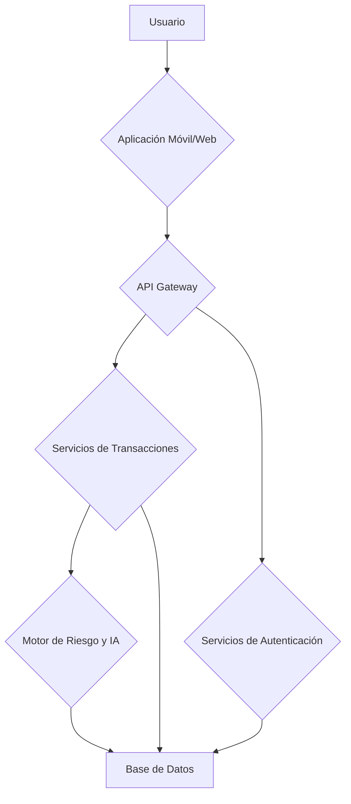

# Security 

Create a more secure security system than the current ones, to prevent theft, scams or any crime that may occur on the web.

# Technical Flowchart
This diagram illustrates the data flow and system components.
owchart TD


# Folder structures
```
proyecto_deteccion_fraude/
│
├── docs/ # Documentación del proyecto
│ ├── diagramas/ # Diagramas de ujo
│ │ ├── tecnico.md
│ │ ├── tecnologias.md
│ │ ├── base_de_datos.md
│ ├── manuales/ # Manuales de usuario o técnicos
│ └── README.md # Documentación principal del proyecto
│
├── src/ # Código fuente del proyecto
│ ├── backend/ # Código del servidor (FastAPI)
│ │ ├── main.py # Punto de entrada de la aplicación
│ │ ├── modelos.py # Modelos de datos (Pydantic)
│ │ ├── rutas/ # Rutas de la API
│ │ │ ├── transacciones.py
│ │ │ ├── usuarios.py
│ │ ├── servicios/ # Lógica de negocio
│ │ │ ├── riesgo.py
│ │ │ ├── autenticacion.py
│ │ ├── cong.py # Conguración de la aplicación
│ │ ├── seguridad.py # Funciones de seguridad (encriptación)
│ │ ├── ia/ # Modelos de IA (ONNX, LightGBM)
│ │ │ ├── modelo_onnx.py
│ │ │ ├── modelo_lightgbm.py
│ │ ├── tests/ # Pruebas del backend
│ │ │ ├── test_transacciones.py
│ │ │ ├── test_usuarios.py
│ │ └── db/ # Conexión a la base de datos
│ │ └── conexion.py
│
│
├── data/ # Datos para el proyecto
│ ├── datos_de_entrenamiento/ # Datos para entrenar los modelos de IA
│ └── datos_de_prueba/ # Datos para probar el sistema
│
├── herramientas/ # Scripts y herramientas útiles
│ ├── scripts_de_bd/ # Scripts para inicializar la base de datos
│ └── otros_scripts.py
│
├── .gitignore # Archivo para ignorar archivos en Git
├── requirements.txt # Lista de dependencias de Python
└── Dockerle # Conguración de Docker (si se usa)
```

# Progress on tasks
 
Replica de un banco digital 
- [x] Conexion a la base de datos
- [x] Crear ruta para el usuario
- [ ] Crear metodo para ingresar al banco (validar clave y usuario)
- [ ] Crear ruta para transacciones 
- [ ] Crear metodos para envio de dinero 
- [ ] Ajustar las repuestas de cada metodo con el http correspondiente
- [ ] Manejar error globales de la api 
- [ ] Agregar la autenficacion con Jws 


# Tasks for later

Tareas que se haran luego
- [ ] Como recolectar informacion de un disposito 
- [ ] como implementar o insertar un Script 
- [ ] Agregar la IA a la api para hacer las validaciones de transaccion 
- [ ] Entrenamiento de la IA para actualizacion de posibles ataques